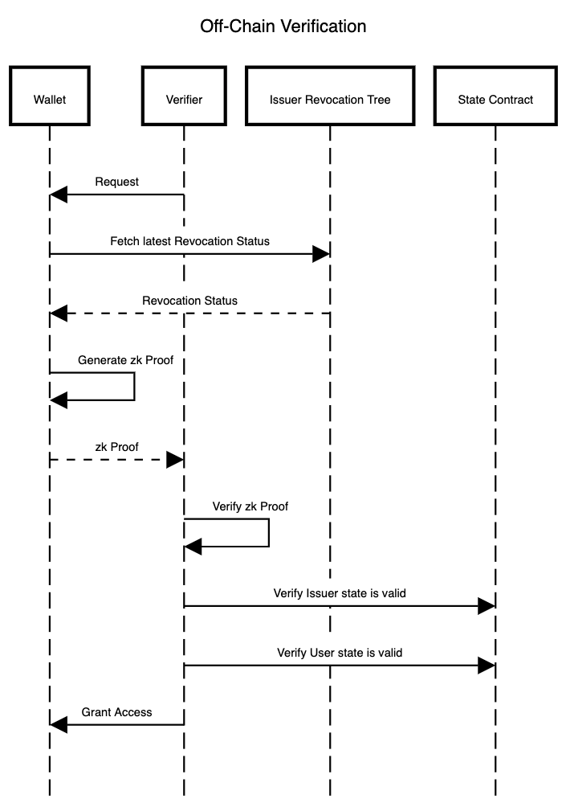

# Offchain Verification Demo PolygonID

> Any application that wants to authenticate user based on their Polygon ID Identity off-chain must set up a Verifier. A Verifier is made of a Server and a Client.



## Description

At its core, every off-chain interaction between a Verifier and a user's Wallet follows this workflow:

- A web application designs a request for the users. This is delivered to the user within a QR code (or via deep-linking; it is up to the implementer). This can either be a auth request or a query-based request.
- The user scans the QR code using his/her mobile ID wallet and parses the request
- The user fetches the revocation status of the requested credential from the Issuer of that credential.
- The user generates a zk proof on mobile according to the request of the website starting from the credentials held in his/her wallet. This also contains the zk proof that the credential is not revoked.
- The user sends the zk proof to the Verifier.
- The Verifier verifies the zk Proof using the verification API.
- The Verifier checks that the State of the Issuer of the credential and the State of the user are still valid and have not been revoked (this is still performed using the same verification API).
- If the verification is successful, the Verifier grants access to the user (or activates any customized logic)

## Usage example

Assume that the request is: "Are you over 18 years old?". The Verifier never gets access to any of the user's credentials. Instead, the Verifier receives a cryptographic proof which, on verification, provides an answer "yes" or "no" to the previous question.

## Get Started

```sh
git clone <repo url>

cd <cloned folder>

```

Edit .env.sample file

```sh
VITE_BASE_URL=http://localhost:3000/
NGROK_URL= (eg.https://2842-2c05-2a80-3b-c10-00-748.eu.ngrok.io) //it can be any url, but should be accessible by your mobile and server
```

```sh
yarn
yarn dev
```

For Query Based auth, uncomment the code bellow.
You can get a KYCAgeCredential from [Demo issuer](https://issuer-demo.polygonid.me/) or any other issuer

```javascript
// ./src/server/GetAuthRequest
const proofRequest = {
  id: 1,
  circuitId: 'credentialAtomicQuerySigV2',
  query: {
    allowedIssuers: ['*'],
    type: 'KYCAgeCredential',
    context:
      'https://raw.githubusercontent.com/iden3/claim-schema-vocab/main/schemas/json-ld/kyc-v3.json-ld',
    credentialSubject: {
      birthday: {
        $lt: 20050101,
      },
    },
  },
};
const scope = request.body.scope ?? [];
request.body.scope = [...scope, proofRequest];
```
